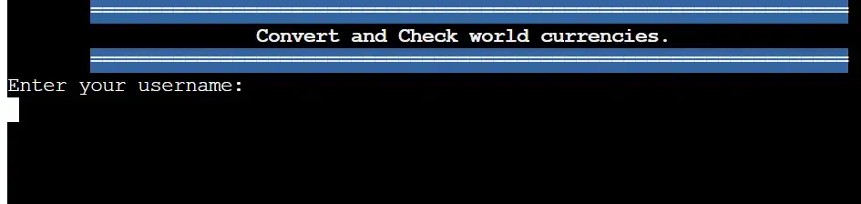

# MyCash - *Real time currency conversion*

[View code here](https://github.com/belovedpearl/Currency_Converter)

## View Live Project

[Link to Deployed Project](https://mycurrency.herokuapp.com/)

---

**Table of Contents:**
---

 * [Project Description](#project-description)
    * [Site Owners Goal](#site-owners-goal)
    * [Users Goal](#users-goal)
    * [Target Audience](#target-audience)
   
* [WireFrames](#wireframes)
     
* [Features](#features)
    * [Existing Features](#existing-features)
        * [Opening Section](#opening-section)
        * [Username Section](#username-section)
        * [Registration Section](#registration-section)
        * [Choice Section](#choice-section)
    
* [Future features](#future-features)
* [Design Choices](#design-choices)
* [Accessibility](#accessibility)

* [Technology, Frameworks and Programs](#technology-frameworks-and-programs)
     * [Language](#language)
     * [Frameworks and Programs](#frameworks-and-programs)
     * [Modules](#modules)

* [Bugs](#bugs)
     * [Fixed Bugs](#fixed-bugs)
     * [Unfixed Bugs](#unfixed-bugs)

* [Deployment](#deployment)
* [Tools](#tools)
* [Testing](#testing)
     * [Validator Testing](#validator-testing)
         * [Pep8](#pep8)
         * [Local Terminal](#local-terminal)
         * [Heroku Terminal](#heroku-terminal)
     * [Functional Testing](#functional-testing)
* [Credit](#credits)
* [Acknowledgement](#acknowledgement)
 

---

 ## Project Description

---

* MyCash as named is  designed to provide real time currency conversion rate to its users.
It is designed to be an handy tool for users to convert the value of one currency to another . It also provides a convenient and efficient way to perform currency conversions for various needs, it can also be used in financial plannings especially when it involves other currencies.

* It can serve as a tool which help business owners easily understand the rate of different currencies and hence make informed decision. The API used is updated every thirty minutes hence it reflect the true rate of different currencies.

* Users can also get performance history of a currency compared to another over a period of 8 days as provided by the API used.

* It also seek to educate its users by providing a list of countries and their currencies. Through it, users are able to buildup understanding about different currencies that exists and thier symbols. 

[View Deployed Site Here](https://mycurrency.herokuapp.com/)
 
---

## Site Owners Goal

---

   * Provide real time currency exchange rate.
   * Provide access to currency conversion with ease.
   * Register its users.
   * Automatically identifies and register new users.
   * Provide users clear instructions on how to navigate the program.
   * To educate its users on currencies and countries around the world.
   * Provide performance data of currencies over a period of time.
   
---

## Users Goal

---

   * To easily navigate and understand the application.
   * To be able to choose what to do with the program.
   * To be able to view the exchange rate.
   * To be informed if wrong units is provided.
   * To get performamce data of currencies to be compared.

---

## Target Audience

---

The program seeks to provide financial service to its users updating them about exchange rate and values of currencies around the world.

It can be used by business that trade in foreign currencies.

---

## Wireframes

---

Lucid Chart was used in planning the project. Below is a representation of my thought on the project. 

---

## Features

---

### Existing Features

Features on the application include:

#### Opening Section:
This consist of the title and a caption introducung the user to what the program does.

#### Username Section:
It takes in the username and opens up the program if the user is registered. This is done with the aid of an attached spreadsheet found [here](https://docs.google.com/spreadsheets/d/1kxl57ezoU2vcIYNEzAwI6kqMVXdASYTNhHftn92GK0Y/edit#gid=0)

#### Registration Section:
The program is designed to automatically detect new user. It checks if the username is present on the worksheet attached, if username is not found, it automatically registers the user to use the program.

#### Choice Section:
Users are prompted to choose their desired path of operation to achieve a desired result.

#### Currency performance
Users can view the performance data of a currency with respect to another over a period of 8 days as provided by the API used.

---

## Future Features

---
 * Add visuals and graphs to show a reflection of performance of different currency overtime, this is to create better view of performance data and aid business analysis of currency flunctuations in order to make decisions.

 * Improve the performance of the application by updating the API version or changing the API used to have access to more data to reference and display.

 * Add a financial forecast feature to futher aid business decisions.

 * Add more display feature to improve user experience.

 * Add terminal background to improve user experience.

 
---

## Design Choices

---

* I have added red color to the header fonts to make some sections stand out to user.

* Red color was used to highlight a notice of wrong input from user.

* Blue color was also added to some statements to improve its visual appearance.

* Green color is used to indicate loading a new section successful.

---

### Font

Standard terminal font is used to present the project.

--- 

## Accessibility

---

This project is a terminal based program, users are prompted for input to move through the application.

Users are given regular feedback on all request made.

Color text are used to improve readability

Sleep timers are used to give some break in the program

---

## Technology, Frameworks and Programs

---

### Language

* PYTHON

---

### Frameworks and Programs

* LucidChart
    * Used to sketch my thought in planing the project

* Github
    * To store written code

* Gitpod
    * This is the IDE used to write the code from where i can push to github.

* Heroku
    * This was used to deploy the web-application.

### Modules

* Os

Used to regulate the system clear function and also to have access to the environment where the API key is saved.

* Request

Provides a way to send request to the API used by importing get function.

* Regulator

An internal module made as an extra file to regulate the performance of the code and to contain code that does not relate to currency exchange.

* Gspread

Allows access to the attached spreadsheet, it also share data with the spreadsheet.

* Credentials

Imported from google.oauth2.service_account, it holds the 
spreadsheet data configuration data and used for authentication for data exchange to take place.

* Json

A built-in package used to work with json data returned from the API.

* Datetime

A built-in package used to manipulate date and times.

* Sys

A bult-in package used to modify elements in the runtime environment. In this project, it was used to print letters within a text in an interactive mode and to force the terminal to force the program to flush the output buffer

* Time

Used to provide function for getting number of seconds to be used in the program.

---

## Bugs

---

### Fixed Bugs

* Rows not appending in the worksheet

    * Converting my data to list before appending helped fixed this

* Heroku not recognising file containing my key.

    * Changed the path to access the key.

* After deployment, Terminal print appeared in black bluring view.

    * Changed the display color after the art to white.

* Error in getting performance history when a decimal or alphabet is provided.

    * Using an except statement to capture the error fixed it.

* Error in getting performance history when a number greater then the provided number is given.

    * Added an if statement to check for number greater then 8.

* System crash when a wrong country identity is provided.
    * Check if the right data is returned before proceeding.

* Program crash with values leass than zero.
    * Check for values less than zero before proceeding.

### Unfixed Bugs
 * To my current understanding, there is no unfixed bug

---

## Deployment

---

### GitHub Pages

* The project was deployed using heroku.

The following illustrate the steps I took to deploy my website;
Fork or clone this repository in the following steps:

### How to Fork

  * Login to GitHub and locate the [GitHub Repository](https://github.com/belovedpearl/Currency_Converter).

  * At the top of the repository just above the **"Settings"** button on the menu, locate the **"Fork"** button.

  * Once **clicked**, you should have a copy of the original repository in your own account.

### To deploy
  * Sign up to create an account with heroku.
  * Click on create a new Heroku app.
  * Add Config Var by clicking on reveal config vars 
  * Set the build packs to Python and NodeJs in exact order.
  * Link the Heroku app to the repository.
  * Click on **Deploy**
  * A few minutes later, after refreshing the page, there will automatically be an update containing the **"live site link"**.

The live link can be found [here](https://git.heroku.com/mycurrency.git/).

---

## Tools

---
  
  *  [Free Currency Converter API](https://free.currencyconverterapi.com/)
  *  [Free Currency Converter API documentation](https://www.currencyconverterapi.com/docs)
  *  [Title Art](https://patorjk.com/)
  *  [Google Sheets API](https://console.cloud.google.com/)
  *  [Google Sheet](https://docs.google.com/spreadsheets/)
  *  [Black Vercel](https://black.vercel.app)
  *  [Python Checker](https://pythonchecker.com/)

---

## Testing

---

### Validator Testing

#### PEP8
* No errors  were found when passed through the official [W3C Validator check](https://validator.w3.org/nu/?doc=https%3A%2F%2Fbelovedpearl.github.io%2FHistoric_Center_Quiz_PP2%2F)

#### Local Terminal

 * I have written the program and ran it several times on my terminal and it all work fine as expected.

### Heroku Terminal
 * The project was deployed to heroku and tested several times to check for performance and handle errors that might occur.

 Output test of some section is illustrated below:

 

 

 

 I have also tested the code using **Python Checker**.

 
 

### Functional Testing

 Functional testing performed for every action within the website. If the behavior is the same as the expected behavior, it will be marked with P for pass, if not F for fail. 

  
| Action (CLICK) | Expected Behavior   | Actual Behavior |
| :---: | :---: | :---: |
| Username |  Takes in the username  | If user is registered, opens up the program   |
|  Press 1 | List the available currncies and symbols  | P   |
| Press 2 | Opens up the conversion section   | P   |
| Press 3 | Gets the exchange rate  of specified currencies printed  | P   |
| Press 4 | List the available countries| p  |
| Press 5 | Performance data of currencies | P  | 
|Press q | Exist the program   | P   |
|Sign-up section  | Adds the new user username to the worksheet  | P |

---

## Credits

* [Importing your own module properly](https://youtu.be/GxCXiSk6no)

* [Python style guide](https://google.github.io/styleguide/pyguide.html)

* [ReadMe Table Inspiration](https://github.com/belovedpearl/Green_Space-PP1/blob/main/README.md)

* [Code institute's template](https://githb.com/https://github.com/Code-Institute-Org/p3-template)

* [Typewriter effect](https://youtu.be/2h8e0tXHfk0)

* [Clear screen function](https://www.101computing.net/python-typing-text-effect/).

* [Import your own modules](https://youtu.be/GxCXiSkm6no)

* [Add color to art](https://youtu.be/u4QMAloo4i0)

* [W3Schools](https://www.w3schools.com/), [Stack overflow](https://www.slackoverflow.com/) & [Mdn wed docs](https://developer.mozilla.org/en-US/) - Visited several times to learn different syntax used in the code.

---

## Acknowledgement

* I will like to thank **My Husband** for his support and understanding during the project, for all encouragement and even getting me on this programme.

* Much love to my **Children** for understanding and encouraging me through this project buildup.

* Special thanks to [Adam Boley](https://github.com/AdamBoley/) for his support during the build up of the project.

* A big thank you to my Mentor, **Sandeep Aggarwal**  for the support, encouragement and thorough enlightment he provided during the buildup of this project.

* Thank you to everyone at **Code Institute** for helping us learn.

